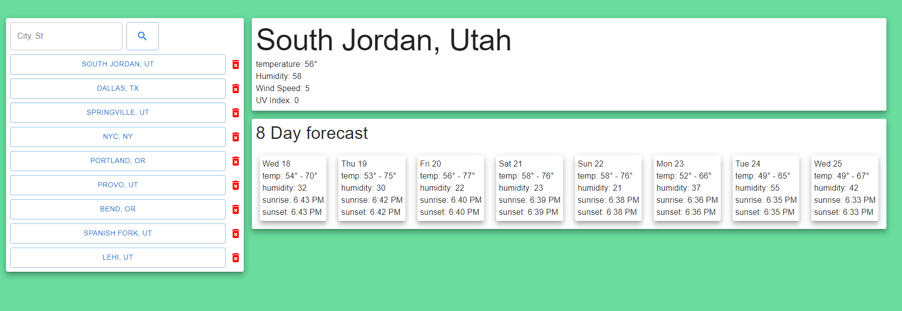

# react portfolio

## Description

A simple site to get weather data for a city that is entered by the use.
* When a city is entered then the current weather and an 8 day forecast is displayed.
* The main reason that I had to build this site was to play around with the useContext hook that is built into react.

<!-- Link to live site: [react-portfolio](https://toveson.github.io/react-portfolio/#/) -->

## Table of Contents

- [react portfolio](#react-portfolio)
  - [Description](#description)
  - [Table of Contents](#table-of-contents)
  - [Technologies](#technologies)
  - [Usage](#usage)
  - [License](#license)
  - [Contributing](#contributing)
  - [Questions](#questions)
    - [Trever Oveson](#trever-oveson)

## Technologies

* [TypeScript](https://www.typescriptlang.org/)
* [React](https://reactjs.org/)
* [material-ui](https://material-ui.com/)

## Usage

Application is invoked locally with command: `npm start`

## License

MIT License

Copyright (c) Trever Oveson

## Contributing

When contributing to this repository, please first discuss the change you wish to make via issue, email, or any other method with the owner(s) of this repository before making a change.

## Questions

For any questions the author(s) can be contacted at:

### Trever Oveson

GitHub: [toveson](https://github.com/toveson)

Email: toveson9522@gmail.com